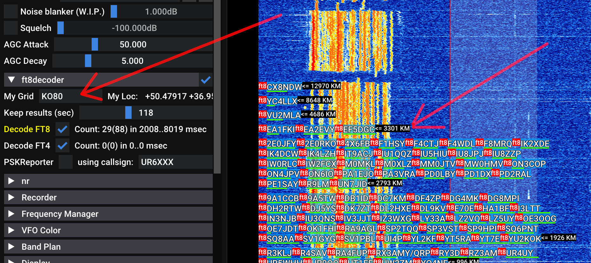
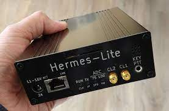

# SDR++Brown is a fork (patch-set) 

Upstream project is also very good, please check it out [by clicking here](http://sdrpp.org). I cannot recomend it enough. 
SDR++Brown is maintaining all original features from it, synchronizing the source code on regular basis.

However, this fork adds several features that could not find their way into the upstream. It is also observed that addition 
of some features in this fork coincided with their appearance in the upstream, implemented more properly.     

Note that different features have different level of maturity. Click for more details.

* [Bundled FT8 decoder](#bundled-ft8-decoder) - extracted from MSHV code, slightly tweaked.
* [Hermes Lite 2 support](#hermes_lite_2_support) - hl2_source plugin.
* [Transmit mode](#transmit-mode) for Hermes Lite 2 - at the time of the writing, basic SSB transmit is implemented.
* 

## Bundled FT8 decoder

Taken from great MSHV project, stripped out of the Qt spaghetti, keeping the spirit of Fortran code but with C++
syntax, pure decoder currently supports FT4/FT8 simultaneous decoding. You enter your location, and you get decodes
instantly, you can even scan the band elsewhere, they are grouped by the distance, so you can 
immediately see the band condition and your antenna performance. Concurrent FT4/FT8 decoding is supported.

## Hermes Lite 2 support

This small device, produced by [Hermes Lite Project](http://www.hermeslite.com/) is an interesting good SDR receiver. 
Made of cheap parts, it has 12bit ADC, 5W Power amplifier, and passband filters. It is connected via Ethernet, so
it does not require any drivers.

Another implementation of same board comes from [LiteSDR project](https://www.litesdr.pp.ua/), formerly Hermes-2000, 
that is slightly less expensive, and has alternative PA and filters schematics, also it is even smaller:

## Transmit mode

(Images to be added)

