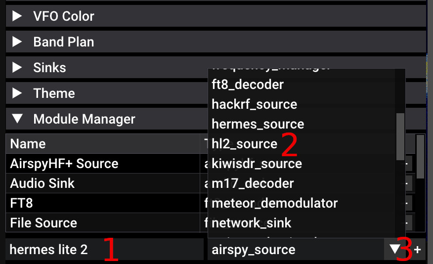
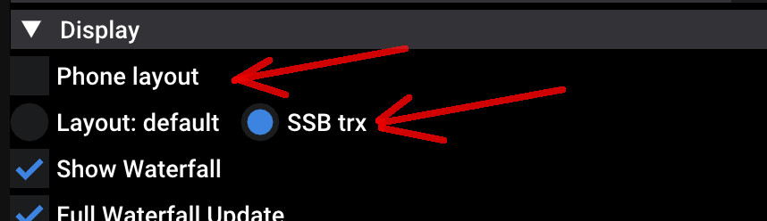
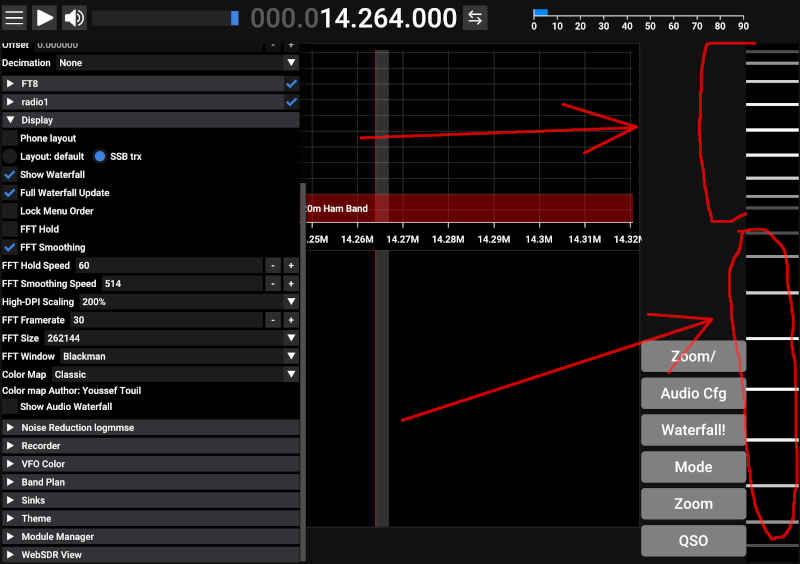
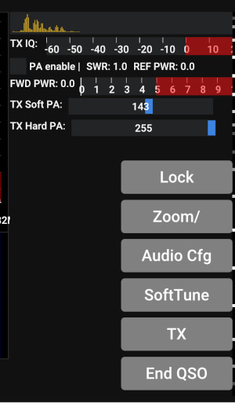
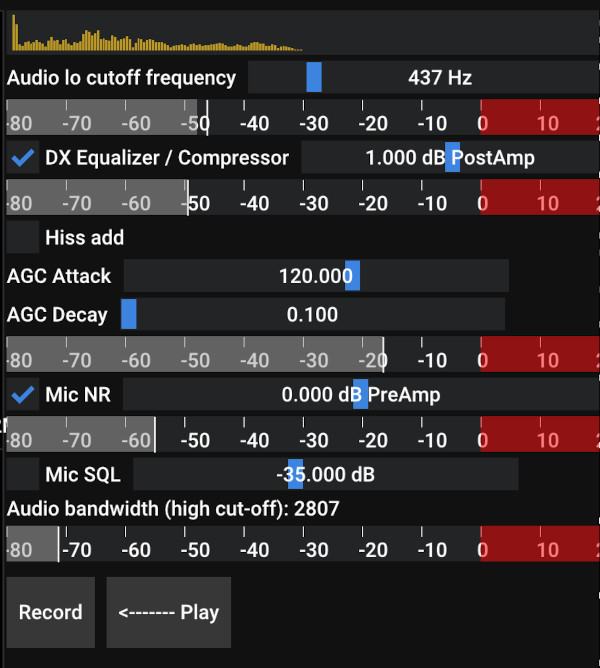

# SDR++Brown transmit functionality

## Recent news (few tx features are reported in main document)

* 2024-05-XX: client/server mode enhancement: TX and baseband compression, password for access.
* 2024-01-XX: bluetooth headset support on android
* 2023-06-12: It is possible to specify direct address of Hermes Lite, if broadcast scanning does not work for your specific network configuration.
* 2023-06-01: Recording of QSO audio for purposes of logging. QSO audio is attached to the logbook. 
* 2023-06-01: Recording CQ call and sending it to the air. 

## Introduction

### Supported hardware

Supported hardware:

* SDRs with Hermes Lite 2 protocol. I have two different models of this transcievers, nothing special. 
Probably, older models and various modifications will work, too. However, there's nothing to control older model's built-in microphone/speaker. 

If you want your hardware to be added, contact me or make code pull request.

### What works

You can receive/transmit SSB (USB/LSB). You can use your microphone of your desktop/notebook computer. You can run SDR++Brown on the 
Android phone while laying on the sofa and use microphone of your smartphone, and use wireless connection to the transciever.
Sofa was the primary driving factor for this software development, and I will add everything to make it work better, 
including small logbook for QSO logging etc. Jokes aside, portable use was primary goal.

Update Spring 2024: You can choose to use the Bluetooth headset on Android. Remote (client/server) SDR++ mode for SSB transmit is now working, too. You can use lossy baseband (waterfall) compression to reduce wifi/mobile traffic.

See example QSO video [https://www.youtube.com/watch?v=CGCXxUXLwr4](https://www.youtube.com/watch?v=CGCXxUXLwr4)

Audio pipeline test [https://www.youtube.com/watch?v=HNrYdeMvFGE](https://www.youtube.com/watch?v=HNrYdeMvFGE)

Video of portable operation here: [https://www.youtube.com/watch?v=wPCf6JJpYos](https://www.youtube.com/watch?v=wPCf6JJpYos) this one is with the phone wired to the transciever via USB-C Ethernet, without WiFi, hence lack of operator mobility.

Sofa-style video here: [https://youtu.be/URkedh_fJyc](https://youtu.be/URkedh_fJyc) this one more recent, with WIFI connection and more complex hardware config. 

### What works poorly

* When you use WiFi, you'll have some packet loss, in best conditions it's quite bearable. 
  It may cause the relay clicks, because it causes IQ stream interruption, and transciever responds this way.
* On Android, SSB audio as played on the phone speaker that sucks on most phone models when comparing it to any headphones inserted. However, 
  in portable conditions, this is acceptable. 

### Recommendations

* Use headphones on Android. Bluetooth headset can give remarkably good microphone audio.
* Use wired connection if possible. Some androids support ethernet over USB, and it works well. Buy USB-C dock with ethernet port. It can also charge your phone while you use it. My third option for the phones that do not support usb ethernet, would be RNDIS(over USB) with an addition of intermediate single board computer (idea is reaping).
* If using WiFi, use 5GHz band, because 2.4GHz could be close to useless, depending on the environment. Portable router with 5GHz band is a good idea.
* Try narrow band for receiving (48 khz) if you have packet loss. It may help.

## How to use

### Selection of the source

As of May 2023, Hermes Lite 2 and compatible is used. You must use hl2_source in sdr++. There's hermes_source,
which is intended to receive only, from upstream, i'm not talking about it. 

In the list of drivers, select "Hermes Lite 2". If it's missing, use Module Manager, add module called "hl2_source". 
Select it from dropdown, type name in the empty text field, and press (+)

Select the Hermes Lite 2 in the Source drop down. Press "Refresh" button if fields are empty. The network
broadcast is sent and device is discovered. If your device is discoverable by other software, it will be
discovered by sdr++. If you have your TRX active in other software, stop it there first.

Select bandwidth (start with 48khz). Press play button on the top. You must see the waterfall and hear the noise.
The ADC gain includes both amplification and attenuation in one control. If there's ADC overflow, it
will be drawn in red. As of present, there's no automatic maximum gain now.

Not reflected on the image: you can enter static IP address as of July 2023. This static IP will be used
along with the default discovery broadcast address list, if default broadcast is not working for you.
Moreover, you can use additional checkbox near the static IP entry to force this IP to be added to the list
regardless of discovery results, and to be directly connected to when you start the receiver stream (play button),
this may help when using various simpler VPN/forwarding schemes.

The filters selection below works. It controls the filter board of your transceiver. 
The checkboxes here are not synchronized with the current frequency (yet?), you have to manually control them.

### Switching to TRX layout

By default, sdr++brown comes with TRX layout disabled. You can enable it in the settings:

Press "SSB trx" to switch to the TRX layout. Select "Phone layout" if you prefer some tweaks on Android,
such as wider scrolling sliders and shorter frequency range selector (the artifact of vertical layout ages).

Please not there's experimental audio waterfall. You can enable it in "Show Audio Waterfall" in the very bottom
of the "Display" section (below color map chooser). 

Android smartphone users: You must select smaller scaling factor in the "Display section" so all controls could fit the small 
screen of your phone.

TRX layout differs from receiving layout: 

* On the right side there's area with buttons. Buttons control the transmitter.
* QSO/End_QSO button enters/leaves the deeper phase of the QSO menus.
* On the far right, there are two inertial encoders. Larger one is TUNE knob, at the bottom. Smaller one on top
  is the VOLUME / ZOOM / BRIGHTNESS knob. You are expected to scroll knobs with your fingers. 

  
### Search mode

Before you talk, you can search in the frequency band, change bands and do some sound setup. 

* "Zoom/", "Volume/", "Brightness/" toggles the function of the upper encoder / knob.
* "Audio Cfg" opens audio settings
* "Waterfall" tries to auto-adjust waterfall brightness. Nobody loves it. Use small knob.
* "Mode" allows quick access to bands and modulations. There are some useful defaults like automatic USB/LSB
  selection depending on the frequency. Last frequency is saved per band and modulation using tricky algorithm
  which is not yet perfect and can annoy. You are warned.
* "Zoom" toggles between various predefined zoom modes. Long press shows the full receiving bandwidth.
* "QSO" toggles next mode where you can find TX button

### QSO mode

After you press "QSO" button you get into the transmit mode. Note, if you don't have waterfall
running, you probably won't see the half of the screen, and see red error text instead. 

Buttons are:

* "Lock" - locks the trequency knob. Because you use your fingers while talking, you sometimes want to
  stay on the frequency. Also, this mode activates (optional) QSO LOG entry dialog.
* "Zoom/", "Volume/", "Brightness/" toggles the function of the upper encoder / knob.
* "Audio Cfg" opens audio settings
* "Soft tune" - generates sine wave. Press again to stop. The hardware tone generation of HL2 is not used. The amplitude of sine wave is controlled by "TX Soft PA". 
* "TX" - transmit button (Android: use "Volume UP" only). TX is on while button is pressed in PTT manner (Short press toggles TX on/off). Microphone sounds then are transmitted to the air. 
* "End QSO" - go back to the Search mode.

On the top you see the oscilloscope of your audio input, as processed.

* "TX IQ" shows the range of IQ stream sent to the radio. Main intention is to control the clipping. 
  Red zone is clipping.  See the [pipeline section](#the-pipeline) for the details.
* "PA enable" to enable 5W power amplifier on the hermes lite 2 board. This is not saved in settings. You 
  must toggle it on manually when you're sober, to not burn up your power transistors.
* SWR, REF PWR show the SWR and reflected power. The forward power is displayed below on the gauge.
* "TX Soft PA" - multiplier for IQ samples sent to the TRX.
* "TX Hard PA" - the 5W power amplifier control provided by the TRX, intended to control the power transistor. 

When you are transmitting the sine wave or the voice, the waterfall will display the spectrum of your voice.
It slightly differs from what can be received over the air, but it mostly reflects the reality. When transmitting without
PA enabled, the signal will be very weak but still visible.

During the transmission, all sounds are muted. The Baseband NR threshold (software) and demodulator AGC state 
are frozen to avoid their unneeded re-adaptation after reception is turned back on. 

### The pipeline

The pipeline is represented on the Audio Cfg screen, and the end of the pipeline is "TX Soft PA" described 
above.

* "Audio lo cutoff frequency" is parameter for high-pass filter that removes bass from the microphone input.
* gauge below represents the signal after that stage.
* "DX equalizer/compressor" is (as of now) the fixed equalizer that boosts the high frequencies and further
  attenuates low frequencies. There's a checkbox. Also, Post-amplifier compensates the compressor results.
* gauge below represents the signal after that stage.
* "Hiss add" - attempts to bring "s" sound in the word "six" from the 5khz into the 1.5khz range of signal. Experimental. 
* "AGC Attack", "AGC Decay" - the signal automatic gain control. Routines are same as on receiving pipeline. 
  I found that setting very low AGC Decay (0.1) helps keeping the signal power pressure mostly constant at 
  maximum, which is good for transmission.
* "Mic NR" - enables the microphone noise reduction (algorithm same as Audio NR2, i.e. OMLSA-MCRA). Very useful on desktop os with simple mic. 
  Not needed for the Android, because Android has its own noise reduction, already used by default.
  Note: the choose the use of processed or raw input in Android pipeline, there's toggle in the Sink section of the main 
  menu. Also note that there's still work in progress, NR2 needs its own AGC that scales from complex numbers to 
  16-bit integers samples because it's implemented in 16-bit integers, and back. Also note that some correspondents note
  the digital nature of the signal and express the disgust.
* There's preamp for Mic NR
* gauge below the "Mic NR" represents the signal after that stage.
* "Mic SQL" enables squelch (silence detection) on the microphone. You know when person uses SDR on PC, their signal contains
  a lot of noises in the pauses. In addition to the Mic NR, Mic SQL works very well in producing
  deep silence in the pauses, reflected in emitted radio signal. Pleasure for eyes and ears. Not applicable in noisy
  environments (children, city street etc).
* "High cut-off" - low-pass filter, that coincides with selected mode width (e.g. 2.7 Khz for SSB). You 
  cannot tune it here, it's tuned by setting the modulator bandwidth in the left menu, or in the "Mode" dialog.
* Final phase is the amp/attenuator of the final IQ signal that is sent to the transmitter. Use "TX Soft PA"
  slider to control the scale, and observe the TX IQ.
* Clipping occurs in the TX driver and is not shown here. Complex IQ data is translated to 16-bit samples. When
  there's next batch of data to send, if any signal has amplitude more than 1, whole batch is attenuated so 
  that conversion does not overflow during float-to-short conversion. This produces quite nice results, eliminates
  lot of out-of-band emissions and I left it that way.

Buttons "Record" and "Play": you can record your own voice and replay it back and observe how it sounds after processing. This is only 
for self-control.   

## My current config

My current phone does not support ethernet over USB, to plug Hermes Lite 2 directly into it, so I use WiFi. I have a small WiFi router that is attached to
the brick consisting of battery, HL2, amplifier, DC down converter and HF tuner, all connected together with a double-sided adhesive tape.
On the router, I use WiFi on 5 GHz band. To achieve cross connectivity between HL2, SDR++ and the internet, i configured it
following way:

* HL2 is connected to the router via ethernet cable.
* Phone is sharing the internet (Android portable hotspot) using WiFi.
* Router is connected to the phone via WiFi (i.e. phone is internet provider for router).
* Router has UDP port 1024 enabled and forwarded to the HL2 IP address. It is important to note that normally routers completely reject all traffic coming from internet side, so it is important to overcome this with a configuration.
* HL2 IP address is fixed, my router's DHCP server remembers and does not randomize addresses.
* I created simple golang program (can be found in repo) that can run on my openwrt router, and it can proxy hermes 2 lite traffic on UDP 1024 port to the backend transceiver. It is not required in the above configuration, but still can be useful.

I also tried the use of USB internet sharing (Phone->Router USB) to avoid occasional 
WiFi interruptions. However, I got used to the wireless freedoms while laying on the sofa, and I can live with occasional glitches in 
this configuration.

Really working configuration for USB (not wireless) connection is following:

1) connect phone to the router that supports this function (take internet from phone over USB), openwrt-based routers with USB definitely do.
2) connect HL2 to router via ethernet, too
3) enable USB sharing on the android, router will be able to ping internet.
4) however, router will prevent access to any its services from phone side, because phone is militarized zone from the router point of view. You need to configure router firewall to allow UDP 1024 port access on the RNDIS interface (or all interfaces)
5) however, that is not enough, and you need to add port forwarding of port 1024 towards the hermes lite, on router.
6) however, if you're more of experimental kind, then instead of p.5 you can try to use proxy written in go, it can compile for openwrt and work fine. You'll have to add it to startup, so it launches automatically.

I wish you luck. The one who persists, will get the result.

I am planning to enhance this proxy, to make smoother wifi connection. Problem with interrupting wifi
is half-duplex nature of wifi. Currently, during transmit or receive, hermes protocol sends
waterfall data and transmit data, in the two directions, always, all the time. 
Proxy will reduce/eliminate one of the unused data streams during transmit/receive, thus
reducing half-duplex issues of wifi that hopefully will make it better. Control streams will
be simulated/replicated on proxy to eliminated drops, to maintain smooth software and hardware work.
This smoothing will be controlled (turned on) by the operator optionally.

## Work in progress

This is work in progress. I'm releasing it because it's more useful than not at this stage. 

Also, because this is a new field for me (digital signal processing), my solutions to the problems may be naive, so
advises are welcome. Please join [Telegram group](https://t.me/sdrpp_hermes_fork) with 
questions, bug reports and propositions.

